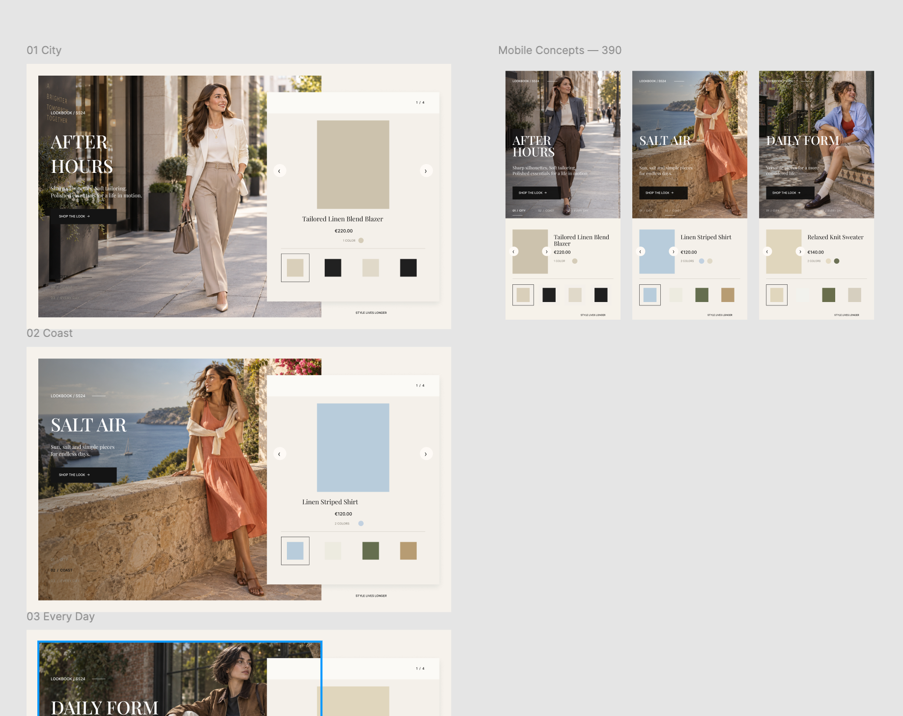
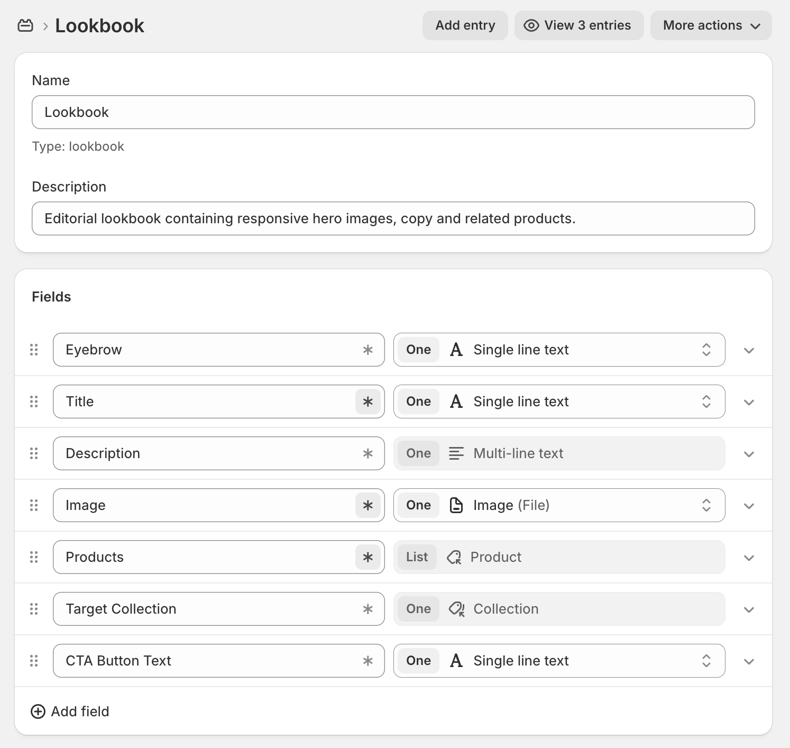

# Shopify Lookbook

Native Shopify Lookbook implementation using Metaobjects, Liquid and theme sections.

The feature includes a merchant-selected Lookbook section for general templates and a Product Lookbook section that automatically renders Lookbooks containing the current product.

## Approach

Before implementation, I considered a broader campaign model similar to a fashion-week or seasonal launch. For example, an Autumn campaign could contain themes such as City, Coast and Everyday, with multiple products grouped under each theme.

That model would support a richer editorial structure, but it would also introduce more hierarchy and more relationships to manage in Shopify Admin. For this challenge, I kept the model flat: one Metaobject entry represents one Lookbook.

This keeps the content model easier to manage and makes the product-matching logic more direct. In a real client project, I would confirm the campaign structure and merchandising workflow with the client or product owner before finalising the model.

I also used AI during the early design exploration stage. We discussed several possible Lookbook layouts, and I used it to generate the sample products, matching product imagery and Lookbook hero assets used in the demo. Some of the original layout exploration is still visible in the Figma file, showing how the design evolved before the final implementation.

## Implementation

### Standard Lookbook

`sections/lookbook.liquid`

The standard section allows the merchant to select a Lookbook Metaobject in the Theme Editor and configure a `hero-left` or `hero-right` desktop layout.

Content is stored in the Metaobject, while the section controls page-level presentation. The product panel reuses the theme's existing `card-product` and `slider-component` implementations instead of duplicating product-card or slider behaviour.

### Product Lookbook

`sections/product-lookbook.liquid`

The Product Lookbook section is enabled only on product templates. It reads `shop.metaobjects.lookbook.values`, checks each Lookbook's product references, and matches them against the current `product.id`.

Matching Lookbooks are rendered automatically. Multiple matches are supported, with `Maximum lookbooks` limiting the number rendered on the PDP.

Each rendered Lookbook receives a unique instance ID to prevent duplicate slider and DOM IDs when multiple Lookbooks appear on the same page.

I initially tested automatic left/right layout alternation, but removed it because hero composition is image-dependent and could place copy over the subject. In production, this behaviour would be confirmed with the client.

### Shared rendering

Both sections render through `snippets/lookbook-content.liquid`, with Lookbook-specific styles defined in `assets/component-lookbook.css`.

The section files handle selection and matching logic, while the shared snippet handles presentation markup. This keeps data resolution separate from the reusable UI.

## Shopify setup

### Metaobject

[Open Lookbook Metaobject definition](https://admin.shopify.com/store/richard-lookbook-challenge/settings/custom_data/metaobjects/lookbook)

`Shopify Admin > Content > Metaobjects > Lookbook`

The Lookbook Metaobject contains:

- Eyebrow
- Title
- Description
- Image
- Products
- CTA Button Text
- Target Collection

`Products` is a list of product references and is used by the Product Lookbook section for PDP matching.

`Target Collection` is a collection reference, so the CTA destination is selected directly from Shopify Admin rather than stored as a raw URL.

Three Lookbook entries were created for the demo:

- [The Workday Edit](https://admin.shopify.com/store/richard-lookbook-challenge/content/metaobjects/entries/lookbook/415563120837)
- [Sunlit Escape](https://admin.shopify.com/store/richard-lookbook-challenge/content/metaobjects/entries/lookbook/415569281221)
- [Off-Duty, Done Right](https://admin.shopify.com/store/richard-lookbook-challenge/content/metaobjects/entries/lookbook/417828765893)

### Theme Editor

For a standard Lookbook, add the `Lookbook` section and select a Metaobject entry.

[Open Theme Editor](https://admin.shopify.com/store/richard-lookbook-challenge/themes/160937312453/editor)

For PDPs, add the `Product Lookbook` section to the product template and configure the heading and maximum Lookbook count.

[Open Product Lookbook in Theme Editor](https://admin.shopify.com/store/richard-lookbook-challenge/themes/160937312453/editor?previewPath=%2Fproducts%2Fburgundy-suede-terrace-sneakers)

### Sample data

The sample products used in the demo were imported into the development store and configured as Shopify products. These products are referenced by the Lookbook Metaobjects and used across the demo.

## Files

| File | Purpose |
| --- | --- |
| `sections/lookbook.liquid` | Merchant-selected Lookbook |
| `sections/product-lookbook.liquid` | PDP matching and render control |
| `snippets/lookbook-content.liquid` | Shared rendering |
| `assets/component-lookbook.css` | Component and responsive styling |

## Preview

Repository: [GitHub repository](https://github.com/GIJoeRambo/demo-shopify-lookbook)

Shopify Admin: [Development store admin](https://admin.shopify.com/store/richard-lookbook-challenge)

Lookbook demo: [Storefront demo](https://richard-lookbook-challenge.myshopify.com/)

Product Lookbook demo: [Product demo](https://richard-lookbook-challenge.myshopify.com/products/fine-gold-pendant-necklace)

Storefront password: `demo`

## Assessment criteria / Checklist

| Criteria | Implementation |
| --- | --- |
| Feasibility | Uses native Shopify Metaobjects, Liquid, theme sections and existing theme components with no third-party app dependency. |
| Technical Writing | README documents the architecture, Shopify setup, data model and reviewer access points. |
| Depth | Covers configurable Lookbook sections, Metaobject-driven content, PDP product matching, multiple matches and responsive rendering. |
| Understanding of Shopify Platform | Uses Metaobject references, Theme Editor settings, Liquid rendering and native theme components. |
| Git | Theme code is maintained in the linked repository with feature development and descriptive commit history. |
| Code | Selection, matching and presentation responsibilities are separated, with shared rendering reused across both section types. |
